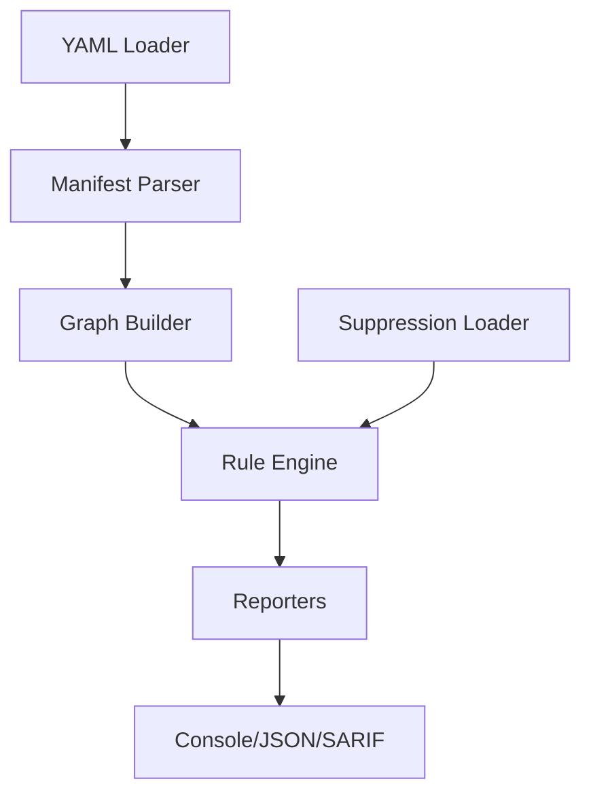

# Design Overview

kube-chainsaw uses graph traversal and static analysis to detect RBAC misconfigurations and privilege escalation paths in Kubernetes manifests.

---

## Architecture



---

## Pipeline Stages

### 1. YAML Loader

- Recursively scans directories for `.yaml` and `.yml` files
- Skips excluded directories (vendor, test, node_modules, .git, examples)
- Supports stdin input for pipe-based workflows

### 2. Manifest Parser

- Parses YAML using PyYAML with safe loading
- Filters for RBAC resources: Role, ClusterRole, RoleBinding, ClusterRoleBinding, ServiceAccount
- Extracts metadata (name, namespace, labels) and rules/subjects

### 3. Graph Builder

Constructs a directed graph representation of RBAC permissions:

- **Nodes**: ServiceAccounts, Roles, ClusterRoles
- **Edges**: RoleBindings, ClusterRoleBindings
- **Attributes**: Verbs, resources, API groups, namespaces

**Graph structure:**

```
ServiceAccount -> RoleBinding -> Role -> Permissions
                                   |
                                   v
                            [apiGroups, resources, verbs]
```

### 4. Rule Engine

Executes 15 detection rules against the graph:

- **Static rules**: Pattern matching on YAML structure (KC-001 through KC-006, KC-009 through KC-015)
- **Graph rules**: Traversal algorithms to detect privilege escalation chains (KC-007, KC-008)

Each rule outputs zero or more findings with severity, location, and remediation advice.

### 5. Reporters

Formats findings for output:

- **Console**: Color-coded, human-readable summary
- **JSON**: Machine-readable for custom integrations
- **SARIF**: GitHub Code Scanning, GitLab SAST, other security platforms

---

## Graph Traversal

kube-chainsaw's key differentiator is its ability to detect **multi-hop privilege escalation paths** through graph traversal.

**Example chain:**

1. ServiceAccount `viewer-sa` is bound to Role `viewer-role`
2. `viewer-role` grants `pods/exec` permission
3. Pods in the namespace mount ServiceAccount `admin-sa`'s token
4. `admin-sa` has `cluster-admin` permissions
5. **Result**: `viewer-sa` can escalate to `cluster-admin` via pod exec

**Detection algorithm:**

```python
def find_escalation_paths(graph, from_sa, to_permission):
    visited = set()
    paths = []
    
    def dfs(current_node, path):
        if current_node in visited:
            return
        visited.add(current_node)
        
        if has_permission(current_node, to_permission):
            paths.append(path + [current_node])
            return
        
        for neighbor in graph.neighbors(current_node):
            dfs(neighbor, path + [current_node])
    
    dfs(from_sa, [])
    return paths
```

This approach catches escalation chains that static linters miss because they only analyze individual manifests in isolation.

---

## Known Limitations

1. **Static analysis only**: kube-chainsaw analyzes manifests, not live cluster state. Runtime RBAC changes (e.g., `kubectl create rolebinding`) are not detected unless the paid plugin is used.

2. **No runtime context**: Cannot detect privilege escalation that depends on runtime conditions (e.g., specific pod configurations, environment variables).

3. **False negatives for dynamic resources**: Custom resources with RBAC implications (e.g., CRDs that create Roles) are not analyzed unless custom rules are defined.

4. **Namespace scoping**: Cross-namespace escalation paths are detected (KC-013), but complex multi-tenant scenarios may require manual review.

5. **Aggregate roles**: ClusterRoles with `aggregationRule` are analyzed statically, but the final aggregated permissions depend on runtime label matching.

---

## Design Principles

1. **CI-first**: Exit codes, SARIF output, and suppression files designed for automated security gates
2. **Zero dependencies**: Core scanner has no external dependencies beyond Python stdlib (PyYAML is bundled)
3. **Deterministic output**: Same manifests always produce same findings (no network calls, no randomness)
4. **Actionable recommendations**: Every finding includes specific remediation steps
5. **Low false positives**: Prioritize accuracy over coverage to avoid suppression fatigue

---

## Performance

kube-chainsaw is optimized for large repositories:

- **10,000 manifests**: ~5 seconds on M1 MacBook Pro
- **100,000 manifests**: ~45 seconds
- **Graph construction**: O(n) where n = number of RBAC resources
- **Rule execution**: O(n * r) where r = number of rules (15)
- **Memory usage**: <100 MB for typical repositories

---

## Comparison to Other Tools

| Tool | Approach | Privilege Chains | Runtime Required |
|------|----------|------------------|------------------|
| **kube-chainsaw** | Static graph traversal | ✅ | ❌ |
| kube-linter | Static pattern matching | ❌ | ❌ |
| KubiScan | Runtime query | ✅ | ✅ |
| rbac-tool | Static analysis | ❌ | ❌ |
| kubectl-who-can | Runtime query | ❌ | ✅ |

kube-chainsaw is the only tool that combines static analysis with graph-based privilege escalation detection.

---

## Next Steps

- [Detection Rules](../reference/rules.md): Full reference of all 15 detection rules
- [Python API](../reference/api.md): Use kube-chainsaw as a library
- [Contributing](../contributing/rules.md): Add new detection rules
