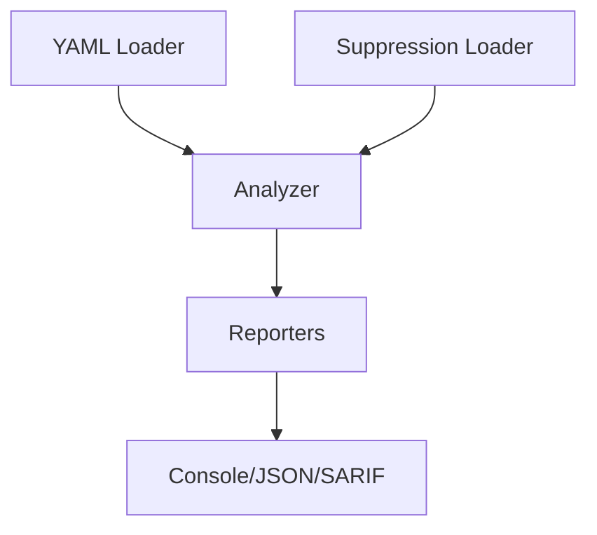

# Design Overview

kube-chainsaw uses graph traversal and static analysis to detect RBAC misconfigurations and privilege escalation paths in Kubernetes manifests.

---

## Architecture

---

## Pipeline Stages

### 1. YAML Loader (pkg/loader)

- Recursively scans directories for `.yaml`, `.yml`, and `.json` files
- Skips excluded directories (.git, vendor, node_modules, bin) by default
- Parses YAML documents using sigs.k8s.io/yaml
- Strips Go template expressions (`{{ }}`) to prevent parser errors
- Enforces file size (10 MB) and document count (10,000) limits
- Categorizes resources into ClusterRoles, Roles, RoleBindings, ClusterRoleBindings, ServiceAccounts, Pods, and Workloads

**Supported workload kinds:**

- Deployment
- DaemonSet
- StatefulSet
- Job
- CronJob
- ReplicaSet

### 2. Analyzer (pkg/analyzer)

Executes 15 detection rules against the loaded resources:

- **Phase 1**: Analyze ClusterRoles for dangerous patterns (KC-001 through KC-012, KC-015)
- **Phase 2**: Analyze Roles (namespace-scoped, severity capped at WARNING)
- **Phase 3**: Privilege chain analysis (KC-013, KC-014)

Each rule outputs zero or more findings with severity, location, and remediation advice.

**Severity is dynamic**, based on how roles are bound:

- Cluster-wide binding with wildcards → CRITICAL
- Cluster-wide binding without wildcards → HIGH
- Namespace-scoped binding with wildcards → HIGH (capped at WARNING for namespace-scoped Roles)
- Namespace-scoped binding without wildcards → WARNING
- Unbound role → INFO

### 3. Suppression (pkg/suppression)

- Loads suppression file (YAML format)
- Validates entries (rule_id and resource_name required)
- Matches findings by rule_id, resource_name, and optionally resource_namespace
- Marks matching findings as suppressed
- Warns on unrecognized rule_id values

### 4. Reporters (pkg/reporter)

Formats findings for output:

- **Console**: Grouped by severity, sorted by rule ID, human-readable
- **JSON**: Machine-readable with all finding fields
- **SARIF**: GitHub Code Scanning, GitLab SAST, includes fingerprints and suppressions

---

## Graph Traversal

kube-chainsaw's key differentiator is its ability to detect **privilege chains** through graph-based analysis.

**Example chain (KC-013):**

1. Pod/Deployment uses ServiceAccount `admin-sa`
2. `admin-sa` is bound to ClusterRole `cluster-admin` via ClusterRoleBinding
3. **Result**: Pod runs with cluster-admin privileges

**Example pattern (KC-014):**

1. RoleBinding references ClusterRole (not namespace-scoped Role)
2. Detected regardless of whether Pods are co-located in manifests
3. **Result**: Warning about dependency on cluster-scoped resource for namespace access

This approach catches misconfigurations that static linters miss because they only analyze individual manifests in isolation.

---

## Known Limitations

1. **Static analysis only**: kube-chainsaw analyzes manifests, not live cluster state. Runtime RBAC changes (e.g., `kubectl create rolebinding`) are not detected.

2. **No runtime context**: Cannot detect privilege escalation that depends on runtime conditions (e.g., specific pod configurations, environment variables).

3. **False negatives for dynamic resources**: Custom resources with RBAC implications (e.g., CRDs that create Roles) are not analyzed unless custom rules are defined.

4. **Namespace scoping**: Cross-namespace escalation paths are detected (KC-013, KC-014), but complex multi-tenant scenarios may require manual review.

5. **Aggregate roles**: ClusterRoles with `aggregationRule` are analyzed statically (KC-015), but the final aggregated permissions depend on runtime label matching.

6. **Go template preprocessing**: Templates are stripped before parsing. Complex Helm charts may require `helm template` before scanning.

---

## Design Principles

1. **CI-first**: Exit codes, SARIF output, and suppression files designed for automated security gates
2. **Zero dependencies**: Compiled static binary with no runtime dependencies
3. **Deterministic output**: Same manifests always produce same findings (no network calls, no randomness)
4. **Actionable recommendations**: Every finding includes specific remediation steps
5. **Low false positives**: API group filtering prevents false positives from CRDs with names matching core resources

---

## Performance

kube-chainsaw is optimized for large repositories:

- **10,000 manifests**: ~2 seconds on M1 MacBook Pro
- **100,000 manifests**: ~20 seconds
- **Graph construction**: O(n) where n = number of RBAC resources
- **Rule execution**: O(n * r) where r = number of rules (15)
- **Memory usage**: <50 MB for typical repositories

---

## Comparison to Other Tools

| Tool | Approach | Privilege Chains | Runtime Required |
|------|----------|------------------|------------------|
| **kube-chainsaw** | Static graph traversal | ✅ | ❌ |
| kube-linter | Static pattern matching | ❌ | ❌ |
| KubiScan | Runtime query | ✅ | ✅ |
| rbac-tool | Static analysis | ❌ | ❌ |
| kubectl-who-can | Runtime query | ❌ | ✅ |

kube-chainsaw is the only tool that combines static analysis with graph-based privilege escalation detection.

---

## Next Steps

- [Detection Rules](../reference/rules.md): Full reference of all 15 detection rules
- [Go API](../reference/go-api.md): Use kube-chainsaw as a library
- [Contributing](../contributing/rules.md): Add new detection rules
