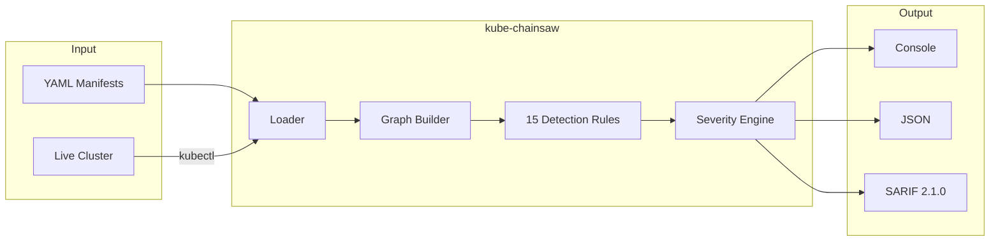

# kube-chainsaw

Graph-level RBAC analysis for Kubernetes manifests

[Get Started](getting-started/installation.md){ .md-button .md-button--primary }
[GitHub](https://github.com/ugiordan/kube-chainsaw){ .md-button }

---

## Demo


---

## How It Works

kube-chainsaw analyzes Kubernetes RBAC manifests by building a directed graph of permissions and traversing privilege escalation paths.



**Pipeline:**

1. **Loader** parses YAML manifests from local files or fetches them from a live cluster via kubectl (ClusterRoles, Roles, Bindings, ServiceAccounts, Pods, Deployments, Jobs)
2. **Graph Builder** maps SA -> Binding -> Role -> verb/resource permission chains
3. **15 Detection Rules** (KC-001 through KC-015) identify dangerous patterns, wildcards, escalation paths
4. **Severity Engine** adjusts severity based on binding scope (cluster-wide vs namespace-scoped vs unbound)

---

## Quick Example

Given a Kubernetes operator with overly permissive RBAC:

```yaml
# roles.yaml
apiVersion: rbac.authorization.k8s.io/v1
kind: ClusterRole
metadata:
  name: my-operator-role
rules:
  - apiGroups: [""]
    resources: ["secrets"]
    verbs: ["get", "list", "watch", "create", "update"]
  - apiGroups: ["rbac.authorization.k8s.io"]
    resources: ["clusterrolebindings"]
    verbs: ["create", "patch"]
---
apiVersion: rbac.authorization.k8s.io/v1
kind: ClusterRoleBinding
metadata:
  name: my-operator-binding
roleRef:
  apiGroup: rbac.authorization.k8s.io
  kind: ClusterRole
  name: my-operator-role
subjects:
  - kind: ServiceAccount
    name: my-operator-sa
    namespace: default
```

Run kube-chainsaw:

```bash
$ kube-chainsaw config/
```

```
=== HIGH ===

  [KC-006] Secrets access
    File:        config/roles.yaml
    Resource:    ClusterRole/my-operator-role
    Description: Role "my-operator-role" grants access to dangerous resource "secrets"
    Remediation: Restrict secrets access to specific namespaces and only the verbs needed

  [KC-010] RBAC modification capability
    File:        config/roles.yaml
    Resource:    ClusterRole/my-operator-role
    Description: Role "my-operator-role" grants access to dangerous resource "clusterrolebindings"
    Remediation: Limit RBAC modification to dedicated admin roles with proper audit

  [KC-011] Privilege escalation via role/binding modification
    File:        config/roles.yaml
    Resource:    ClusterRole/my-operator-role
    Description: Role "my-operator-role" can create/modify roles or bindings (privilege escalation risk)
    Remediation: Restrict ability to create/modify roles and bindings to admin users only

Total: 3 findings [3 HIGH]
```

Generate SARIF for GitHub Code Scanning:

```bash
kube-chainsaw config/ --format sarif --output results.sarif
```

---

## Comparison

| Tool | Static Analysis | Live Cluster | Graph Traversal | Privilege Chains | Workload Analysis |
|------|:-:|:-:|:-:|:-:|:-:|
| **kube-chainsaw** | :white_check_mark: | :white_check_mark: | :white_check_mark: | :white_check_mark: | :white_check_mark: |
| kube-linter | :white_check_mark: | :x: | :x: | :x: | :x: |
| KubiScan | :x: | :white_check_mark: | :white_check_mark: | :white_check_mark: | :x: |
| rbac-tool | :x: | :white_check_mark: | :white_check_mark: | :x: | :x: |
| kubectl-who-can | :x: | :white_check_mark: | :white_check_mark: | :x: | :x: |

kube-chainsaw performs graph traversal on YAML manifests or live clusters to detect privilege escalation chains. It works pre-deployment on static files or post-deployment via `--from-cluster`.

---

## Features

<div class="grid cards" markdown>

-   :material-graph:{ .lg .middle } **Graph Traversal**

    ---

    Builds SA -> Binding -> Role -> verb/resource permission graphs. Detects multi-hop privilege escalation paths that flat rule-based linters miss.

-   :material-shield-check:{ .lg .middle } **Static + Live Analysis**

    ---

    Analyzes manifests before deployment or scans a live cluster via `--from-cluster`. Works in CI pipelines, local development, and production audits.

-   :material-file-document:{ .lg .middle } **SARIF Output**

    ---

    Native SARIF 2.1.0 for GitHub Code Scanning, GitLab SAST, and other security platforms. Includes fingerprints for deduplication.

-   :material-robot:{ .lg .middle } **CI-First Design**

    ---

    Exit codes, machine-readable output, and suppression files designed for automated security gates in CI/CD pipelines.

</div>

---

## What Gets Detected

15 detection rules covering:

| Category | Rules | Examples |
|----------|-------|---------|
| **Wildcard permissions** | KC-001, KC-002 | `resources: ["*"]`, `verbs: ["*"]` |
| **Dangerous verbs** | KC-003, KC-004, KC-005 | escalate, impersonate, bind |
| **Sensitive resources** | KC-006 to KC-010 | secrets, pods/exec, nodes, PVs, clusterrolebindings |
| **Escalation combos** | KC-011, KC-012 | create/patch on roles/bindings, workload creation |
| **Privilege chains** | KC-013, KC-014 | cluster-admin pods, RoleBinding->ClusterRole |
| **Aggregation** | KC-015 | aggregated ClusterRoles |

See [Detection Rules](reference/rules.md) for the full reference with YAML examples.

---

## Next Steps

<div class="grid cards" markdown>

-   [Installation Guide](getting-started/installation.md)
-   [Quick Start Tutorial](getting-started/quickstart.md)
-   [CI Integration](guides/ci-integration.md)
-   [Detection Rules Reference](reference/rules.md)

</div>
