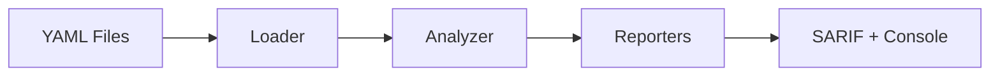

# kube-chainsaw

Graph-level RBAC analysis for Kubernetes manifests

[Get Started](getting-started/installation.md){ .md-button .md-button--primary }
[GitHub](https://github.com/ugiordan/kube-chainsaw){ .md-button }

---

## How It Works

kube-chainsaw analyzes Kubernetes RBAC manifests by building a directed graph of permissions and traversing privilege escalation paths.



**Pipeline stages:**

1. **Loader** (pkg/loader): Parses YAML manifests from directories and files
2. **Analyzer** (pkg/analyzer): Runs 15 detection rules to identify privilege escalation chains and misconfigurations
3. **Reporters** (pkg/reporter): Outputs findings in SARIF, JSON, or human-readable console format

---

## Comparison

| Tool | Static Analysis | Graph Traversal | Privilege Chains |
|------|----------------|-----------------|------------------|
| **kube-chainsaw** | ✅ | ✅ | ✅ |
| kube-linter | ✅ | ❌ | ❌ |
| KubiScan | ❌ | ✅ (runtime only) | ✅ |
| rbac-tool | ✅ | ❌ | ❌ |
| kubectl-who-can | ❌ | ✅ (runtime only) | ❌ |

kube-chainsaw is the only tool that performs **static graph traversal** to detect privilege escalation chains before deployment.

---

## Features

<div class="grid cards" markdown>

-   :material-graph:{ .lg .middle } **Graph Traversal**

    ---

    Builds a directed graph of RBAC permissions to detect multi-hop privilege escalation paths that static linters miss.

-   :material-shield-check:{ .lg .middle } **Static Analysis**

    ---

    Analyzes manifests before deployment. No runtime access required. Works in CI pipelines, pre-commit hooks, and local development.

-   :material-file-document:{ .lg .middle } **SARIF Output**

    ---

    Native SARIF support for GitHub Code Scanning, GitLab SAST, and other security platforms. Includes fingerprints for deduplication.

-   :material-robot:{ .lg .middle } **CI-First Design**

    ---

    Exit codes, machine-readable output, and suppression files designed for automated security gates in CI/CD pipelines.

</div>

---

## Quick Example

Scan a directory of Kubernetes manifests:

```bash
kube-chainsaw manifests/
```

**Output:**

```
=== CRITICAL ===

  [KC-013] Pod running with cluster-admin privileges
    File:        manifests/deployment.yaml
    Resource:    default/Deployment/operator
    Description: Deployment "operator" uses ServiceAccount "admin-sa" which is bound to cluster-admin
    Remediation: Never use cluster-admin for pod service accounts; create a scoped role

=== HIGH ===

  [KC-002] Wildcard verb access
    File:        manifests/roles.yaml
    Resource:    ClusterRole/admin-role
    Description: Role "admin-role" has dangerous verb "*"
    Remediation: Replace wildcard (*) verbs with specific verbs needed

Total: 2 findings [1 CRITICAL, 1 HIGH]
```

Generate SARIF for GitHub Code Scanning:

```bash
kube-chainsaw manifests/ --format sarif --output results.sarif
```

---

## What Gets Detected

kube-chainsaw identifies 15 categories of RBAC misconfigurations and privilege escalation vectors:

- **Dangerous permissions**: wildcard verbs, cluster-admin bindings, secret access
- **Privilege chains**: multi-hop paths from low-privilege ServiceAccounts to admin resources
- **Misconfigurations**: overly broad bindings, unused ServiceAccounts, duplicate rules
- **Supply chain risks**: default ServiceAccounts with elevated permissions

See [Detection Rules](reference/rules.md) for the full list.

---

## Next Steps

<div class="grid cards" markdown>

-   [Installation Guide](getting-started/installation.md)
-   [Quick Start Tutorial](getting-started/quickstart.md)
-   [CI Integration](guides/ci-integration.md)
-   [Detection Rules Reference](reference/rules.md)

</div>
